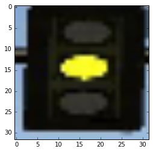
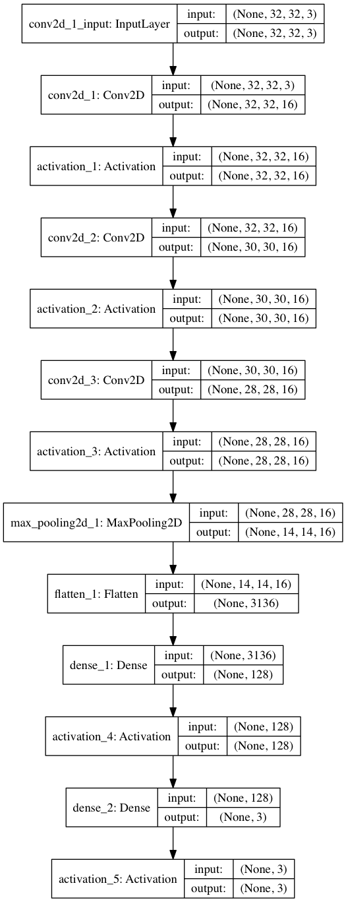

# Udacity Self-Driving Car Engineer Nanodegree

* * *

## Final Project - System Integration

## Team SiliconCar

The System Integration project is the final project of the Udacity Self-Driving Car Engineer Nanodegree. As a team, we built ROS nodes to implement core functionality of the autonomous vehicle system, including traffic light detection, control, and waypoint following. This software system will be deployed on Carla (Udacity’s Self Driving Lincoln MKZ) to autonomously drive it around a test track.

## The Team

### Jean-François Vanreusel

jfvanreu@gmail.com

Director of Globalization at Adobe in San Jose, CA.

Project Contributions: Team Lead, traffic light detector and classification controller.

### Doug Guastaferro

[dguastaferro@gmail.com](mailto:dguastaferro@gmail.com)

Software Engineering Manager based in San Francisco. Amateur mechanic & DIY enthusiast.

Project contributions: Waypoint publisher, node communication infrastructure, callback for traffic light publisher

### Thomas Antony

[tantony.purdue@gmail.com](mailto:tantony.purdue@gmail.com)

PhD Candidate at Purdue University

Project Contributions: 

Implemented and tuned PID Controller for throttle, proportional controller for brakes, path/velocity planning for stopping at traffic lights, testing traffic light detector on GPU, performance tuning of ROS communication system to reduce lag.

### Kyle Guan

Email: kcguan@gmail.com

Research Scientist at Nokia Bell Labs based in Holmdel, New Jersey

Project Contributions: Train and evaluate deep-learning models for traffic light detection and traffic-light color classification to achieve the best trade-off between accuracy and computation time.

### Sean Scheideman

searn@ualberta.ca

MSc Student at the University of Alberta

Project Contributions: Setup twist controller to follow waypoints, stopping based off of traffic light state, testing on real bag files.

## Software Architecture

*Note: For this project, the obstacle detection node is not implemented*

## Perception Subsystem

This subsystem reads the world surrounding the vehicle and publishes relevant information to other subsystems. Specifically, this subsystem determines the state of upcoming traffic lights and publishes their status to other subsystems.

### Traffic Light Detection Node

A crucial part of the vehicle’s self-driving capabilities comes from the ability to detect and classify upcoming traffic lights. This node processes images provided by the vehicle’s onboard camera and publishes upcoming traffic light information to the /traffic_waypoint topic. The Waypoint Updater node uses this information to determine if/when the car should slow down to safely stop at upcoming red lights.  We take a two-stage deep learning based approach in traffic light classification. That is, the traffic light detection module consists of two CNN based models: traffic light detection (localization) and (light) color classification.

Traffic Light Detection

Traffic light detection takes a captured image as input and produces the bounding boxes as the output to be fed into the classification model. After many trial-and-errors, we decided to use [TensorFlow Object Detection API](https://github.com/tensorflow/models/tree/master/research/object_detection), which is an open source framework built on top of TensorFlow to construct, train and deploy object detection models. The Object Detection API also comes with a collection of detection models pre-trained on the [COCO dataset](http://mscoco.org/) that are well suited for fast prototyping. Specifically, we use a lightweight model: ssd_mobilenet_v1_coco that is based on Single Shot Multibox Detection (SSD) framework with minimal modification. The COCO dataset contains images of 90 classes ranging from vehicle to human. The index for traffic light is 10. Though this is a general-purpose detection model (not optimized specifically for traffic light detection), we find this model sufficiently met our needs, achieving the balance between good bounding box accuracy (as shown in the following figure) and fast running time.

The traffic-light detection is implemented in get_localization(self, image, visual=False) function in CarND-Capstone/tree/master/ros/src/tl_detector/light_classification/tl_classifier.py. The traffic-light detector drops any camera frames that are older than 0.2 seconds to overcome any lag in the system.

Traffic Light Classification

After locating the bounding box for the traffic light, we crop the image to only include the traffic light, resize it to 32x32, and pass this along to the object classification step, as shown in the following figure. 

We use a simple CNN for our classification. It consists of three convolutional layer with (3x3 kernel), followed by a max_pooling layer, a flatten layer, and two fully connected layers. The architectural details of the CNN are shown in the following:

For training images, we use a combination of web scraping, simulator image capturing, and ROSbag image capturing. We use Keras (with Tensorflow as backend) for training with a total of 2,000 images (10% of which as validation/test samples). Except for normalization, we do not use other image augmentation techniques. We trained for 25 epochs and can achieve >99% validation/test samples. We save the model into the .h5 file.  The traffic-light classification is implemented in get_classification(self, image) function in CarND-Capstone/tree/master/ros/src/tl_detector/light_classification/tl_classifier.py.

Performance Tuning

The traffic light detection system was initially found to be always lagging 2-3 seconds behind the simulator despite improvements in prediction time and setting the queue size to one. This was due to a bug in how ROS processes large messages. The camera image subscriber was modified to have a large buffer size (52 Mb) and a queue size of one. 

Another possible bottleneck was found to be in the very-first image processing step which was somehow very slow compared to the later ones. To overcome this, during the initialization of the tl_detector node, the traffic light localizer/classifier is called with an empty 800x600 image ensuring that all the TensorFlow systems are initialized. This ensured that subsequent evaluations were much faster.

## Planning Subsystem

The planning subsystem plans the vehicle’s path based on the vehicle’s current position and velocity along with the state of upcoming traffic lights. A list of waypoints to follow is passed on to the control subsystem.

### Waypoint Loader Node

This node was implemented by Udacity. It loads a CSV file that contains all the waypoints along the track and publishes them to the topic /base_waypoints. The CSV can easily be swapped out based on the test location (simulator vs real world).

### Waypoint Updater Node

The bulk of the path planning happens within this node. This node subscribes to three topics to get the entire list of waypoints, the vehicle’s current position, and the state of upcoming traffic lights. Once we receive the list of waypoints, we store this result and ignore any future messages as the list of waypoints won’t change. This node publishes a list of waypoints to follow - each waypoint contains a position on the map and a target velocity.

Every time the vehicle changes its position, we plan a new path. First, we find the closest waypoint to the vehicle’s current position and build a list containing the next 200 waypoints. Next, we look at the upcoming traffic lights. If there are any upcoming red lights, we adjust the speed of the waypoints immediately before the traffic light to slow the vehicle to a halt at the red light. The vehicle speed is controlled by the following rules:

1. If the car is within 30 waypoints of a green light, we slow to 5 mph. The reasoning behind this is that a green light lasts only 2-3 seconds in the simulator and we would not make it past the light on time if we kept going at full speed anyway.

2. If the car is within 50 waypoints of a red/yellow light, start slowing down with a linearly interpolated speed that would get it to a stop at the light.

3. If the car is within than 25 waypoints of a red/yellow light, we slow to 5 mph.

4. If the car is less than 4 waypoints from the stop-line for the light, command a full stop.

5. In all other cases, command the max-speed of 10 mph

The final list of waypoints is published on the /final_waypoints topic.

## Control Subsystem

This subsystem publishes control commands for the vehicle’s steering, throttle, and brakes based on a list of waypoints to follow. 

### Waypoint Follower Node

This node was given to us by Udacity. It parses the list of waypoints to follow and publishes proposed linear and angular velocities to the /twist_cmd topic

### Drive By Wire (DBW) Node

The DBW node is the final step in the self driving vehicle’s system. At this point we have a target linear and angular velocity and must adjust the vehicle’s controls accordingly. In this project we control 3 things: throttle, steering, brakes. As such, we have 3 distinct controllers to interface with the vehicle.

#### Throttle Controller

The throttle controller is a simple PID controller that compares the current velocity with the target velocity and adjusts the throttle accordingly. The throttle gains were tuned using trial and error for allowing reasonable acceleration without oscillation around the set-point.

#### Steering Controller

This controller translates the proposed linear and angular velocities into a steering angle based on the vehicle’s steering ratio and wheelbase length. To ensure our vehicle drives smoothly, we cap the maximum linear and angular acceleration rates. The steering angle computed by the controller is also passed through a low pass filter to reduce possible jitter from noise in velocity data.

#### Braking Controller

This is the simplest controller of the three - we simply proportionally brake based on the difference in the vehicle’s current velocity and the proposed velocity. This proportional gain was tuned using trial and error to ensure reasonable stopping distances while at the same time allowing low-speed driving. Despite the simplicity, we found that it works very well.

## Known Issues

1. Due to the 10mph speed restriction and the timing of traffic lights, the car may not successfully make it through the intersection before the light turns red again. This can be solved by adjusting the light timing or increasing the speed limit. 

